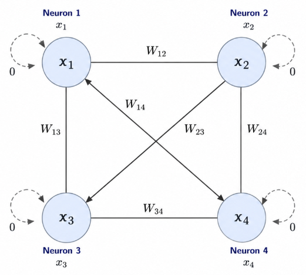

# Thinking Beyond Transformers: Memory-Centric Neural Architectures.

## Research goal

Come up with a neural architecture with a fundamentally better long-term memory mechanism than existing recurrent or attention-based models, enabling more efficient reasoning, longer context retention and improved scalability towards superintelligence.

## Core Research Questions

- Why do current architectures forget?
- What should constitute a "memory"?
- When should a memory be formed?
- How should memories be organized?
- How should memories be retrieved?
- Can memory formation itself be learned?
- Can memory scale independently of computation?

## Why move away from Transformers?

It's not that Transformers are inefficient, we are trying to figure out if there are any fundamental bottlenecks that prevent transformers from scaling efficiently toward AGI/Superintelligence.

Some basic inefficiencies of Transformers:
1. O(n^2) complexity in attention.
2. The concept of KV cache - grows linearly with the number of tokens in the input.
3. No persistent memory bw sessions/documents.
4. Every token reprocesses history instead of maintaining some kind of state.
5. Huge memory bandwidth requirements for large models.
6. Context window is not equivalent to memory. (once tokens are gone, they're gone)
7. Poor continual/lifelong learning.
8. Compute scales with seq len.

Paves the way for the research question:  
> "Can we design an architecture whose computation depends on the amount of useful information rather than the number of past tokens?" 

But before we try to answer this question, we need to build a strong case against Transformers. 

### KV Cache Explosion

KV Cache was born out of an inherent limitation of transformers - the need to remember every token representation in the context window. The transformer is without any compression state and to calculate which previous tokens are relevant to the current token, it needs to either recompute K and V for every token or store all previous K, Vs for that token in memory i.e., Every generated token must keep its Keys and Values alive for future attention.

Hence memory grows as:

- O(seq len)
- O(num layers)
- O(KV Heads)
- O(batch size)

Simply cannot store every token forever - poor design. Existing solutions (e.g., periodic KV rewriting, learned compression, bottlenecked Transformers) are too dependent on KV Cache to such an extent that the field is largely optimizing KV management rather than solving the root problem. This will lead to a point where the model will not be able to scale any further.

Is this an actual problem - yes, does it affect current reasoning performances to a huge extent - no, will this problem be a bottleneck for scaling to ASI - yes.

### Quadratic Attention Complexity

Comparing every token with each other (kind of like a full connected graph bw all tokens) is a O(n^2) operation - expensive. As context grows:

- Compute explodes.
- Latency increases.
- Energy consumption increases (not that i care, but a case to be made).
- Cost per inference increases.

Hence ultra-long context reasoning (ASI should not be restricted by context window limits, unlimited context?) becomes economically impractical. Long context windows demands immense GPU memory bandwidth, hence creating scaling walls for high-res inputs or ultra-long docs. Intelligence should not require comparing every memory with every other memory.

Now, what about solutions like flash attention? Here's why (read it from the perspective of a person who is trying hard to prove that Transformers are not the best architecture for ASI):

**FlashAttention**
- Doesn't reduce O(n^2).
- Only makes it GPU efficient.

**Sparse attention**
- Assumes most interactions aren't needed.
- Can miss important long-range dependencies.

**Linear attention**
- Changes the attention function.
- Often loses expressiveness or requires architectural tradeoffs.

**SSMs**
- Compress history into a fixed state.
- Can struggle with recalling arbitrary past information.

The solution is not to compute pairwise interactions faster, but it might be to not compute pairwise interactions at all.

### Memory Bandwidth Bottleneck

SK Hynix and Samsung will be pissed if I come up with a solution for this :). Modern GPUs are often limited not by arithmetic throughput, but by how fast they can move data between high-bandwidth memory (HBM) and on-chip SRAM, leading to model systems spending an enormous amount of time moving data, not computing. Why:

- attention required reading all previous K/V vectors (flash attention solves this to a great extent).
- each layer has billions of params.
- activations don't fit entirely in SRAM (flash attention saves the day again).

Future models will have larger contexts, more parameters, more simultaneous users etc, and each one of these is only going to increase memory traffic. Eventually the bottleneck becomes bytes/second (i think we might have already hit this point).

Even if future hardware becomes 10× faster computationally, intelligence won't scale proportionally if the architecture still spends much of its time waiting on memory transfers. This is a classic example of Amdahl's Law: speeding up computation helps less and less if data movement dominates execution time.

### Poor to No Continual Learning

Once trained, the model is essentially frozen. It cannot naturally learn from new experiences. Inference does not update the model. In an ideal scenario, ASI should:

- improve daily.
- adapt continuously.
- accumulate knowledge from new experiences.
- update beliefs.
- never stop learning.

But transformers are not designed for this. They are designed for one-time training and inference. Finetuning is not a solution, can't scale to millions of updates/day. Solutions like replay buffers and adapter based learning might be of use to us for this use case.

### Common link - memory

The first five bottlenecks all revolve around memory:

- KV cache - working memory.
- Attention - accessing memory.
- Context window - temporary memory.
- IO - moving memory.
- Continual learning - updating memory.

We're converging on the first major research question to work on:
> "What is the correct computational model of memory for an intelligent system?"

## The theory of memory: What should constitute a "memory"?

The goal at the end of this section is to define exactly what constitutes a "memory" and the requirements for the same to achieve AGI/Superintelligence.

Ability to store and retrieve information over time. Has been a fundamental aspect of human cognition. Our brain processes sensory inputs into short term and long term memories, short tem being memories that are unrehearsed and unimportant, and long term being memories that are rehearsed and important (even though some information will be lost over time as memory importance degrades).

These memories are again divided into categories like semantic memories (words, concepts, objects etc), episodic memories (experiences, events, etc) and procedural memories (skills, habits, etc). Procedural memories are further divided into implicit (unconscious, automatic) and explicit (conscious, effortful). There are also other concepts like memory consolidation, where our brain stabilizes memory traces after their initial formation, primarily during restful states like sleep. This phase involves the brain reactivating and reorganizing memories, weaving them into existing knowledge networks.

### Memory inspired neural architectures

Going to pick stuff directly from [3] in [references.md](references.md) for this section. Going to skip RNNs, LSTMs and Transformers. Our focus will be mainly on other memory-augmented neural architectures (MANNs).

#### Hopfield Networks

Hopfield Networks were the first instance of associative neural networks: RNN architectures which are capable of producing an emergent associative memory[5]. Single layer of interconnected neurons. Information is stored in the weights of the network (represented as the strength of connections bw neurons).

<figure align="center">
  
  <figcaption align="center">Figure 1: Hopfield Network with four units/neurons.</figcaption>
</figure>

Weight between two neurons *W* can be described as the extent to which the output of one neuron will contribute to the activation of the other and vice versa. This is built from the correlations bw all pairs of data vectors[3]. Expressed using the equation:

$$
W_{ij} = \sum_{s=0}^{M-1} x_i^s \cdot x_j^s \quad \text{where } i \neq j \text{ and } W_{ij} = 0 \text{ where } i = j \tag{1}
$$

Each neuron in the network has three qualities:

1. Connections: Each neuron in the network is conencted to all other neurons, and each connection has a unique strength. These connection strengths are what is stored as the weight matrix.
2. State: Each neuron has a bipolar state (-1 or 1). Output of the neuron, computed using neuron's activation and a threshold function.
3. Activation: The input to the neuron, computed using the connections and the state of the neuron. Single scalar value.

Connections between the neurons are symmetric, i.e., if neuron *i* is connected to neuron *j* with a strength of +1, neuron *j*'s connection to neuron *i* will also have a strength ot +1. We can store the weights of a network with n neurons in a square matrix of shape *nxn* (weight matrix *W*, diagonal weights are null, i.e., a neuron is not connected to itself). 

Correlations are learned using Hebbian learning rule, where we strengthen correlated synapses and weaken negatively correlated ones. Computationally more efficient compareed to backprop. Recall is an iterative process where the network updates its state until it stabilizes:

$$
x_i(t+1) = f_h\left[\sum_{j=0}^{N-1} W_{ij} \cdot x_j(t)\right] \tag{2}
$$

$f_h$ is a threshold function that maps the activation to a bipolar state ($-1$ or $+1$). Each step, a neuron (or all neurons, depending on async vs sync update) recomputes its activation from the weighted states of every other neuron and flips if needed. Repeat until the state stops changing.

This works because stored patterns sit as attractors in an energy landscape. The network energy is roughly:

$$
E = -\frac{1}{2}\sum_{i,j} W_{ij}\, x_i\, x_j \tag{3}
$$

Every update decreases (or leaves unchanged) $E$, so the dynamics are guaranteed to converge to a local minimum. Ideal case: that minimum is a stored memory. Real case: it might also be a spurious state (mixture of memories or other local optima).

**Limitations (classical Hopfield)**

- Storage capacity is tiny: roughly $0.15N$ patterns for $N$ neurons before recall errors blow up[3].
- Crosstalk between patterns creates noise and spurious attractors.
- Binary / bipolar states only (classical version).
- Fully connected $N \times N$ weight matrix - memory for the memory itself scales poorly.
- One-shot Hebbian write is nice, but capacity and interference make it a non-starter as a scalable long-term memory.

So classical Hopfield might have given us the right *idea* of memory (distributed, associative, attractor-based, content-addressable) and the wrong *scale*.

**Modern Hopfield Networks**

Ramsauer et al.[4] revisit this with continuous states and a sharper energy (log-sum-exp over stored patterns). Capacity jumps from linear in $N$ to exponential (under pattern separation assumptions). I don't think its worth exploring though, runs into all the same issues that a attention based model would run into.

**What to take from Hopfield for our research**

Useful:

- Memory as attractors / energy minima, not a flat token list.
- Content-addressable retrieval (nearest memory) instead of O(n) scan over history.
- Write via local / one-shot rules (Hebbian) rather than full backprop over the archive.
- Pattern completion under noise - closer to how brains actually retrieve.

Not useful as-is:

- Classical capacity ceiling.
- Equating "modern Hopfield = attention" without solving persistence - that just renames the transformer bottleneck.
- Fully materializing every past pattern in $X$ - same linear growth problem as KV cache.

#### Neural Turing Machines

